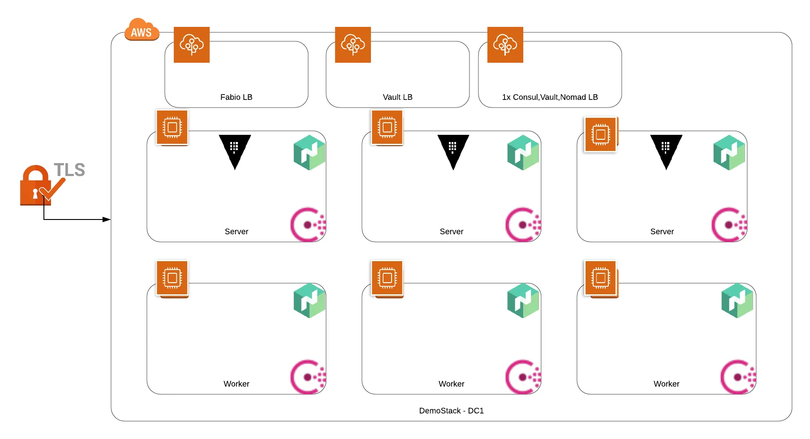

# terraform-aws-demostack
Meant as a reference (and a demo enviroment) and not for production use,
this project configures Nomad, Vault, and Consul (all from Hashicorp) on a variable number of servers and workers. 

Set up are Nomad jobs, Vault configurations, and Consul queries. 

## Solution Diagram


## Dependencies
 <TODO>

 ### TLS

 <TODO>

 ## Consul

 <TODO>

 ## Vault

 <TODO>

 ## Nomad

 <TODO>

## Troubleshooting
To begin debugging, check the cloud-init output:

```shell
$ sudo tail -f /var/log/cloud-init-output.log
```
